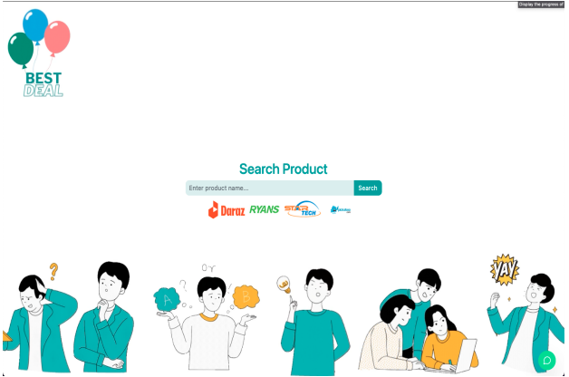
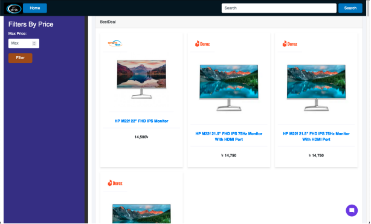
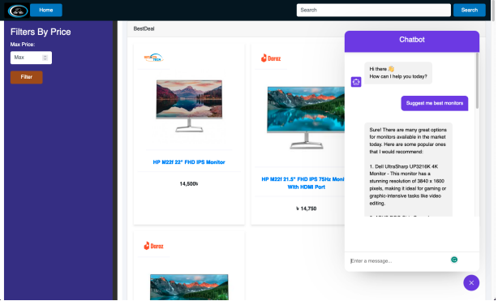

# BestDeal
A Comparative Shopping Web Application


BestDeal is a powerful Comparative Shopping Web Application that empowers users to find the best prices for products across various online platforms. With a user-friendly interface and robust web scraping capabilities, BestDeal simplifies the process of comparing prices, making informed purchasing decisions, and saving money. BestDeal offers seamless integration with a chatbot, enabling users to interact naturally and obtain real-time assistance for their shopping needs.

<div style="display: flex; justify-content: space-around;">
  
  
  
</div>

## Features
1. Product Search: Users can search for products by keywords.
2. Price Comparison: The application displays prices from various online retailers for the searched product.
3. User-Friendly Interface: Intuitive design for easy navigation and usability.
4. Customization: Users can customize their search preferences and filter results.
5. Saved Searches: Users can save their searches for future reference.
6. Chatbot Integration: Real-time chatbot assistance for product inquiries and recommendations.

## Technology Stack
* Django
* Selenium
* Websockets (`channels` package)
* GPT4ALL

## Running the project
### Dependencies
```
pip install django selenium daphne channels strsimpy gpt4all
```
### Setting up the environment
#### Download Orca Mini Model
Download Orca Mini Model. 
Download model: https://drive.google.com/drive/folders/1BkdWrhxrQMBDU6OcRFjbRkPMJWDSbEho?usp=drive_link

Set the environment variable `MODEL` to the path of the Orca Mini Model and Set the environment variable `BROWSER` to the path of the Brave browser.

##### For Windows
```cmd
set BROWSER="path/to/brave"
set MODEL="path/to/orcamini"
```

##### For macOS (Fish shell)
```
set -Ux BROWSER '/Applications/Brave Browser.app/Contents/MacOS/Brave Browser'
set -Ux MODEL 'path/to/orcamini'
```

##### For Bash (Linux/Unix/macOS)
```bash
export BROWSER="path/to/brave"
export MODEL="path/to/orcamini"
```

### Running the project
```bash
python manage.py makemigrations
python manage.py migrate
python manage.py runserver 
```
